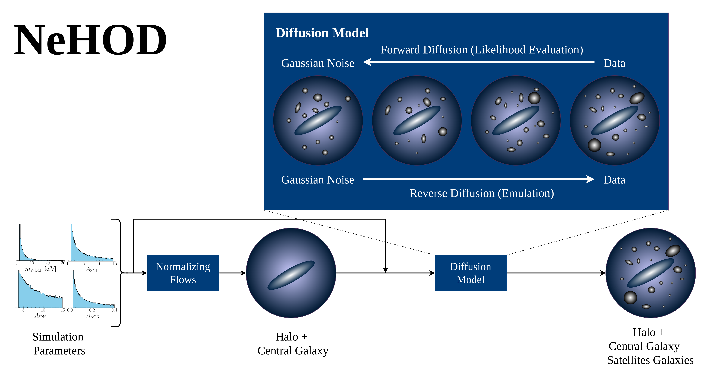

# NeHOD: Neural Halo Occupation Distribution
Code repository for preprint:

- **How DREAMS are made: Emulating Satellite Galaxy and Subhalo Population
  with Diffusion Models and Point Clouds** ([arXiv:2409.02980](http://arxiv.org/abs/2409.02980))

- **Authors**: [Tri Nguyen](mailto:trivtnguyen@northwestern.edu), [Francisco Villaescusa-Navarro](fvillaescusa@flatironinstitute.org), [Siddharth Mishra-Sharma](smsharma@mit.edu), [Carolina Cuesta-Lazaro](cuestalz@mit.edu), and the DREAMS Collaboration


NeHOD is a machine learning-based model for painting galaxies onto dark matter (DM) halos, similar to the Halo Occupation Distribution (HOD) model.
NeHOD models galaxies as point clouds using a Variational Diffusion Model with a Transformer-based noise model.
Point clouds allow NeHOD to resolve small spatial scales down to the resolution of the simulations.

NeHOD consists of two main components:
1. A normalizing flow that is conditioned on the simulation parameters and predicts the halo and central galaxy properties.
2. A VDM to model satellite galaxies given the central galaxy properties, the halo properties, and simulation parameters.

NeHOD operates hierarchically, where during inference, the VDM is conditioned on properties predicted by the flows.
During training, both the flows and the VDM are optimized independently.




The diffusion model is implemented using `torch` and follows quite closely the implementation in Cuesta-Lazaro & Mishra-Sharma 2023 (CM23, see repo info below).
The flow model is a neural spline flow from the `zuko` library.
Training is managed using `pytorch-lightning`, and configuration is handled using `ml_collections`.

Notable link:
- NeHOD: [arXiv:2409.02980](https://arxiv.org/abs/2409.02980)
- CM23: [arXiv:2311.17141](https://arxiv.org/abs/2311.17141).
- CM23 repo: [smsharma/point-cloud-galaxy-diffusion](https://github.com/smsharma/point-cloud-galaxy-diffusion)

## Requirements
Core ML requirements are:
- `Python >= 3.11`
- `torch >= 2.0.1`
- `pytorch-lightning >= 2.1.3`
- `ml_collections >= 0.1.1`
- `zuko >= 1.1.0`
- `numpy >= 2.1.0`
- `scipy >= 1.14.1`

Additional requirements are (mostly for input/output and logging):
- `absl-py >= 2.0.0`
- `pandas >= 2.2.2`
- `PyYAML >= 6.0.2`
- `tqdm >= 4.66.1`


Full requirements can be found in `requirements.txt`. To install all requirements, run:
```bash
pip install -r requirements.txt
```

## Simple training example
The syntax for running the training script is simple:
```bash
python train.py --config config/example_vdm.py  # for the VDM
python train_flows.py --config config/example_flows.py  # for the NSF
```
The VDM and flows are trained independently, so this can be done in parallel.
The example config files are found in the `config` directory.

Most of the configuration is handled in the `config/*.py` files, which are Python files that return a dictionary with the configuration parameters.
See `ml_collections` [(repo)](https://github.com/google/ml_collections) for more details on how to define configuration files.

## Tutorial
Example notebooks and data are provided in the `example` directory. Note that only a subset of the data is provided. For access to the full data, please refer to [the DREAMS project documentation](https://dreams-project.readthedocs.io/).

The notebooks are:
- `0_training_vdm.ipynb`: Training the diffusion model. Also show how the data is formatted and load.
- `1_training_flows.ipynb`: Training the neural spline flows model using `zuko`.
- `2_inference.ipynb`: Loading the trained models and generating new samples.

## Trained models

The trained models used in the preprint can be downloaded from the following link:
[Dropbox](https://www.dropbox.com/scl/fi/2lvkuuivpju8x1hhhh9qn/trained-models.zip?rlkey=yvmajri3zsd8rukd6tj0cflpw&st=aaxw9wi1&dl=0).


For instructions on how to use the trained models, please refer to the `example/2_inference.ipynb` notebook, which demonstrates how to load the trained models and generate samples.

## Correspondence
For any questions related to the preprint ([arXiv:2409.02980](https://arxiv.org/abs/2409.02980)), please contact the corresponding authors:
- [Tri Nguyen](mailto:trivtnguyen@northwestern.edu)
- [Francisco Villaescusa-Navarro](fvillaescusa@flatironinstitute.org)
- [Siddharth Mishra-Sharma](smsharma@mit.edu)
- [Carolina Cuesta-Lazaro](cuestalz@mit.edu)

For any questions or issues related to the repository, please contact the code maintainer: [Tri Nguyen](mailto:trivtnguyen@northwestern.edu).

## Citation
If you are using this code, please cite the following paper:

NeHOD paper:
```bibtex
@ARTICLE{2024arXiv240902980N,
       author = {{Nguyen}, Tri and {Villaescusa-Navarro}, Francisco and {Mishra-Sharma}, Siddharth and {Cuesta-Lazaro}, Carolina and {Torrey}, Paul and {Farahi}, Arya and {Garcia}, Alex M. and {Rose}, Jonah C. and {O'Neil}, Stephanie and {Vogelsberger}, Mark and {Shen}, Xuejian and {Roche}, Cian and {Angl{\'e}s-Alc{\'a}zar}, Daniel and {Kallivayalil}, Nitya and {Mu{\~n}oz}, Julian B. and {Cyr-Racine}, Francis-Yan and {Roy}, Sandip and {Necib}, Lina and {Kollmann}, Kassidy E.},
        title = "{How DREAMS are made: Emulating Satellite Galaxy and Subhalo Populations with Diffusion Models and Point Clouds}",
      journal = {arXiv e-prints},
     keywords = {Astrophysics - Astrophysics of Galaxies, Astrophysics - Cosmology and Nongalactic Astrophysics, Computer Science - Machine Learning},
         year = 2024,
        month = sep,
          eid = {arXiv:2409.02980},
        pages = {arXiv:2409.02980},
archivePrefix = {arXiv},
       eprint = {2409.02980},
 primaryClass = {astro-ph.GA},
       adsurl = {https://ui.adsabs.harvard.edu/abs/2024arXiv240902980N},
      adsnote = {Provided by the SAO/NASA Astrophysics Data System}
}
```

CM23 paper:
```bibtex
@article{Cuesta-Lazaro:2023zuk,
    author = "Cuesta-Lazaro, Carolina and Mishra-Sharma, Siddharth",
    title = "{A point cloud approach to generative modeling for galaxy surveys at the field level}",
    eprint = "2311.17141",
    archivePrefix = "arXiv",
    primaryClass = "astro-ph.CO",
    reportNumber = "MIT-CTP/5651",
    month = "11",
    year = "2023"
}
```
